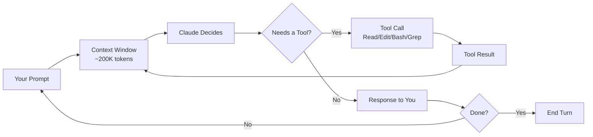
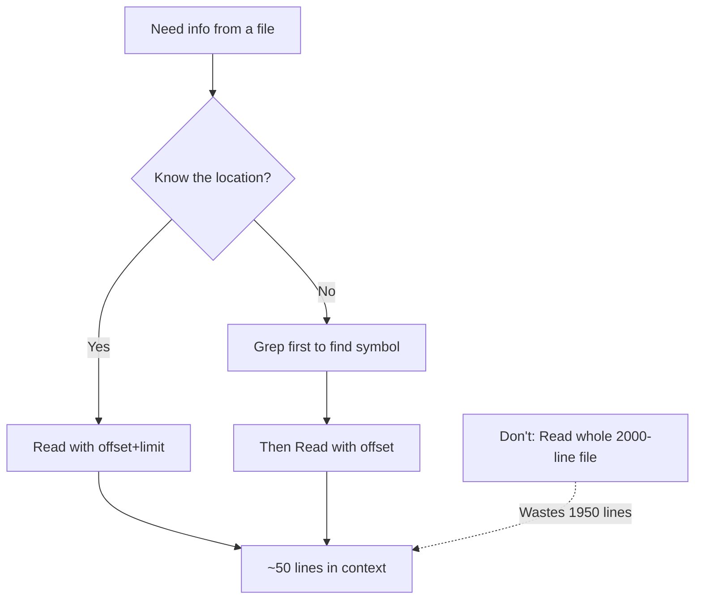
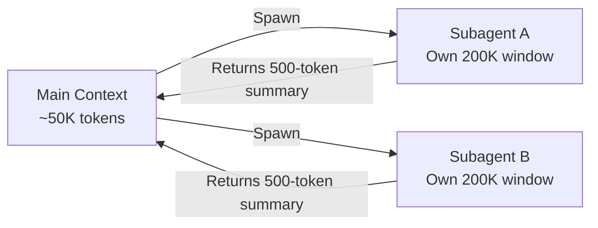
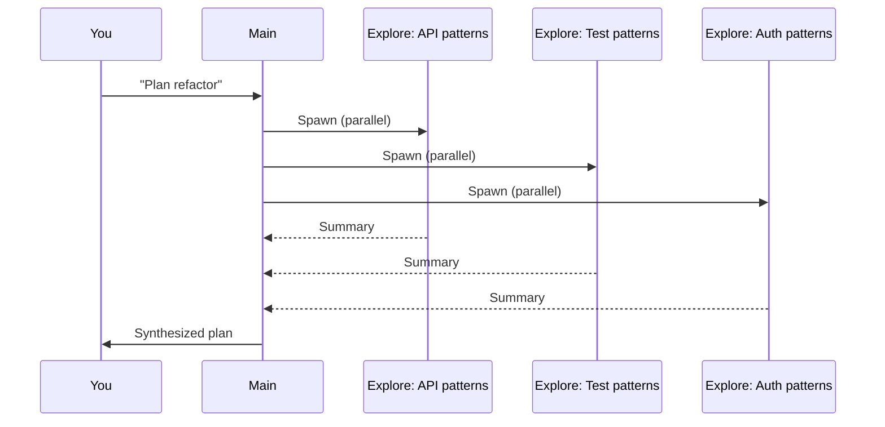
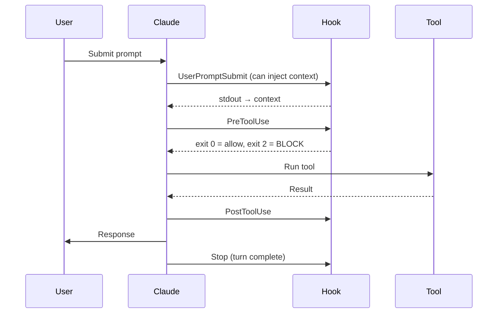
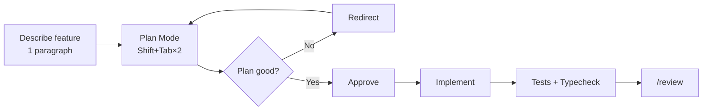
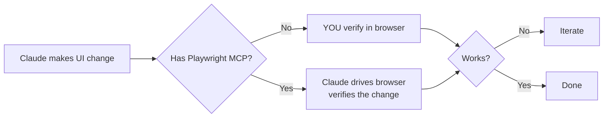

<div align="center">

# 🧠 Mastering Claude Code

### A Staff Engineer's Playbook for Professional, Token-Efficient AI Pair Programming

*Built for full-stack engineers working with React, TypeScript, Next.js, Node.js, and the broader MERN ecosystem.*

[](https://docs.anthropic.com/en/docs/claude-code/overview)
[](LICENSE)
[](#contributing)

</div>

---

## 📖 Table of Contents

<details>
<summary>Click to expand</summary>

- [Why This Guide Exists](#-why-this-guide-exists)
- [1. Mental Model — How Claude Code Actually Works](#1--mental-model)
- [2. The CLAUDE.md File — Your Highest-Leverage Tool](#2--claudemd--your-highest-leverage-tool)
- [3. Auto-Memory — Cross-Session Knowledge](#3--auto-memory)
- [4. Context Management — The #1 Token Saver](#4--context-management)
- [5. Plan Mode](#5--plan-mode)
- [6. Slash Commands & Skills](#6--slash-commands--skills)
- [7. Subagents](#7--subagents)
- [8. Hooks — Automate Around the Loop](#8--hooks)
- [9. MCP Servers](#9--mcp-servers)
- [10. Permissions & Settings](#10--permissions--settings)
- [11. The Five Workflows](#11--the-five-workflows)
- [12. React/TS/Next.js Tips](#12--reactts--nextjs-tips)
- [13. Token-Saving Habits](#13--token-saving-habits)
- [14. Anti-Patterns](#14--anti-patterns)
- [15. Tricky Tips Power Users Know](#15--tricky-tips-power-users-know)
- [16. Keyboard Shortcuts Cheatsheet](#16--keyboard-shortcuts-cheatsheet)
- [17. Recommended Resources](#17--recommended-resources)
- [18. First-Week Setup Checklist](#18--first-week-setup-checklist)

</details>

---

## 🎯 Why This Guide Exists

Most developers use Claude Code like a chat box. They paste code, ask vague questions, accept whatever it produces, and burn through tokens.

**Staff engineers use it like a junior teammate with no long-term memory:** they brief it sharply, constrain its scope, automate the boring parts, and verify before trusting.

This guide is the second approach, distilled.

---

## 1. 🧩 Mental Model

Claude Code is **not** a chat window. It's an **agentic loop** with tools running in your shell.



### The 3 Levers of Quality

| Lever | What It Means | How to Pull It |
|---|---|---|
| **Context quality** | What's in the window right now | CLAUDE.md, intentional reads, `/clear` |
| **Tool choice** | Right tool for the job | Grep > Bash, subagent > main thread |
| **Scope discipline** | Small, defined tasks | Plan mode, explicit constraints |

### When to Start a New Session

- ✅ Task finished
- ✅ Switching domains (frontend → infra)
- ✅ Context feels polluted with dead-end exploration
- 🔧 Use `/clear` to wipe, `/compact` to summarize-and-continue

---

## 2. 📝 CLAUDE.md — Your Highest-Leverage Tool

`CLAUDE.md` files auto-load into every session. They're the difference between a junior and senior collaborator.

### Loading Hierarchy

```
~/.claude/CLAUDE.md              ← Global (you, all projects)
        │
        ▼  merged with
<repo>/CLAUDE.md                 ← Project-wide
        │
        ▼  merged with
<repo>/<subdir>/CLAUDE.md        ← Loaded when working in that dir
        │
        ▼
       SESSION CONTEXT
```

### What Belongs in a Project CLAUDE.md

| Include ✅ | Skip ❌ |
|---|---|
| Stack & versions (React 18, TS 5, Next 14) | Anything in `package.json` |
| Run/build/test commands | The full file tree |
| Architecture in 5 lines | Long prose explanations |
| Conventions ("no default exports") | Stale TODOs |
| Gotchas ("dev server is HTTPS on 5173") | Code samples > 20 lines |
| Branching & PR rules | Anything that rots quickly |

### Pro Tips

- 🎁 Run `/init` in a fresh repo — Claude drafts CLAUDE.md by exploring. Then trim it.
- 📎 Use `@path/to/file` inside CLAUDE.md to include other files (e.g. `@docs/conventions.md`).
- 🪶 Keep it under ~200 lines. Every line is re-read on every turn.

### Minimal Template

```markdown
# Project Name

**Stack:** React 18 + TS 5 + Vite 7 + Tailwind
**Node:** v20.x

## Commands
- `npm run dev` → https://localhost:5173
- `npm run build` / `npm run lint` / `npm test`

## Architecture (TL;DR)
- State: Redux Toolkit + React Query
- Data fetching: React Query (never raw fetch in components)
- Forms: React Hook Form + Zod
- Routing: React Router v6 (see src/Constants/Routes.tsx)

## Conventions
- No default exports
- No `any`, no `@ts-ignore`
- Components in PascalCase folders
- Hooks live in src/Helpers/CustomHooks/

## Gotchas
- Dev server runs HTTPS — accept the cert
- Service Worker cached: hard-refresh after SW changes
- IndexedDB persists Redux — clear via DevTools when debugging state

## PR Rules
- PRs target `prod` (not `main`)
- Conventional commits required
- Run `npm run lint` before pushing
```


---

## 3. 💾 Auto-Memory

Separate from CLAUDE.md, Claude maintains persistent memory at `~/.claude/projects/<slug>/memory/` across sessions.

### Memory Types at a Glance

| Type | What It Stores | Example |
|---|---|---|
| **user** | Your role, preferences | "Staff FE engineer, prefers terse responses" |
| **feedback** | Corrections + validated approaches | "Don't mock the DB — got burned last quarter" |
| **project** | Non-derivable project facts | "Merge freeze begins 2026-03-05" |
| **reference** | Pointers to external systems | "Bugs in Linear INGEST project" |

### How It Works

You generally don't write these manually. Claude saves them when:
- You say "remember that…"
- You correct it ("no, don't do X")
- You confirm a non-obvious approach ("yes, exactly")

> 💡 **Tricky tip:** Memory can become stale. When Claude recalls a memory that names a file or function, it should `grep` to verify the thing still exists before recommending it.

---

## 4. 🎚️ Context Management

> Context bloat = slow + expensive + dumber Claude. This is the most underrated skill.

### Read Intentionally



### Delegate to Subagents to Stay Lean

Subagents run in **isolated context windows**. Their full exploration doesn't pollute yours — only the summary returns.



**Use a subagent when:**
- Searching across many files (>3 queries worth)
- You only need an answer, not the raw output
- Multiple independent tasks can run in parallel

### Parallelize Independent Work

Multiple tool calls in **one message** run in parallel. Use this for:
- Reading several files at once
- `git status` + `git diff` + `git log` together
- Spawning multiple subagents simultaneously

> ⚡ **Tricky tip:** A single message with 5 parallel tool calls is dramatically faster than 5 sequential messages — and uses fewer tokens (less framing overhead).

### Compact vs Clear

| Command | What It Does | When |
|---|---|---|
| `/compact` | Summarizes context, keeps continuity | Mid-task, hitting limits |
| `/clear` | Wipes everything | Between unrelated tasks |

---

## 5. 📋 Plan Mode

Triggered with **`Shift+Tab`** (cycles modes) or by Claude calling `EnterPlanMode`.

In plan mode, Claude **cannot edit files** — only read/explore. It produces a plan you approve before execution.

### When to Use Plan Mode

| Always ✅ | Skip ❌ |
|---|---|
| New features (>1 file) | Typo fixes |
| Refactors | Single-line changes |
| Architectural changes | Obvious bug fixes |
| Anything where wrong = 30+ min wasted | Pure exploration / Q&A |

> 🎯 **The math:** A 5-minute plan that prevents a 45-minute wrong-direction implementation is the highest-ROI habit in this guide.

---

## 6. ⚡ Slash Commands & Skills

### Built-in Commands You Should Memorize

| Command | Purpose |
|---|---|
| `/init` | Bootstrap CLAUDE.md from codebase |
| `/clear` | Wipe context |
| `/compact` | Summarize and continue |
| `/help` | List commands |
| `/model` | Switch model (Opus / Sonnet / Haiku) |
| `/cost` | Show token usage |
| `/permissions` | Manage tool permissions |
| `/agents` | Manage subagents |
| `/mcp` | Manage MCP servers |
| `/hooks` | Manage hooks |
| `/review` | Review a PR |

### Custom Slash Commands — Build Your Own

Create `.claude/commands/<name>.md` (project) or `~/.claude/commands/<name>.md` (global).

**Example: `.claude/commands/component.md`**
```markdown
---
description: Scaffold a new React component with TS + tests
---
Create a new React component named $ARGUMENTS.
- TypeScript with proper prop types
- Follow patterns in src/components/
- Add Vitest test file alongside
- No default exports
```

Run with: `/component UserCard`

> 🪄 **Tricky tip:** `$ARGUMENTS` interpolates the entire string after the command. You can also use `!`-prefixed shell blocks inside command markdown — Claude executes them and sees the output as part of the prompt.

### Building a Personal Slash Command Library

Common ones worth creating:
- `/scaffold-page` — new Next.js page with layout, loading, error
- `/add-hook` — new custom hook with tests
- `/refactor-to-rq` — migrate raw fetch to React Query
- `/a11y-audit` — accessibility review of changed files
- `/perf-check` — render performance review


---

## 7. 🤖 Subagents

Define custom subagents in `.claude/agents/<name>.md` (project) or `~/.claude/agents/` (global).

**Example: `.claude/agents/react-reviewer.md`**
```markdown
---
name: react-reviewer
description: Reviews React/TS code for hooks correctness, render perf, and a11y
tools: Read, Grep, Glob
model: sonnet
---
You are a senior React reviewer. Focus on:
- Hook dependency arrays (missing/excessive deps)
- Unnecessary re-renders (memoization opportunities)
- Missing keys, accessibility issues
- Proper TypeScript types (flag any `any`)

Report findings as: file:line — issue — suggested fix.
```

### Built-in Subagent Types

| Subagent | Best For |
|---|---|
| `Explore` | Fast codebase exploration with tunable depth |
| `Plan` | Architectural planning before implementation |
| `general-purpose` | Open-ended multi-step research |
| `claude-code-guide` | Questions about Claude Code itself |

> 🔥 **Tricky tip:** Subagents do **not** inherit your conversation history. Pass all needed context in the prompt. A subagent that doesn't know what you're trying to accomplish gives generic answers.

### Parallel Subagent Pattern



---

## 8. 🪝 Hooks — Automate Around the Loop

Hooks run shell commands at lifecycle events. Configure in `.claude/settings.json`.

### Hook Lifecycle



### Hook Events Reference

| Event | Fires When | Common Use |
|---|---|---|
| `UserPromptSubmit` | Before your prompt is sent | Inject git status, branch, env |
| `PreToolUse` | Before any tool call | Block dangerous commands |
| `PostToolUse` | After tool completes | Auto-format on Edit/Write |
| `Stop` | Turn ends | Run typecheck, send notification |
| `SessionStart` | New session | Pull latest context |
| `SessionEnd` | Session ends | Save artifacts |
| `Notification` | Permission prompts | Desktop alert |
| `SubagentStop` | Subagent finishes | Log telemetry |
| `PreCompact` | Before compaction | Inject summary into compacted state |

### Exit Code Semantics

| Code | Meaning |
|---|---|
| `0` | Success — continue |
| `1` | Warning (logged, continues) |
| `2` | **BLOCKS the action** — stderr is shown to Claude as the reason |

### Useful Recipes

**Auto-format edited files:**
```json
{
  "hooks": {
    "PostToolUse": [{
      "matcher": "Edit|Write",
      "hooks": [{ "type": "command", "command": "prettier --write \"$CLAUDE_FILE_PATHS\"" }]
    }]
  }
}
```

**Block edits to `.env`:**
```json
{
  "hooks": {
    "PreToolUse": [{
      "matcher": "Edit|Write",
      "hooks": [{ "type": "command", "command": "case \"$CLAUDE_FILE_PATHS\" in *.env*) echo '.env editing blocked' >&2; exit 2;; esac" }]
    }]
  }
}
```

**Typecheck after every turn:**
```json
{
  "hooks": {
    "Stop": [{ "hooks": [{ "type": "command", "command": "npm run typecheck" }] }]
  }
}
```

> 🧙 **Tricky tip:** A `UserPromptSubmit` hook that prints to stdout silently injects that text into Claude's context as system context. Use it to auto-attach `git status`, current branch, or recent test failures to every prompt.

---

## 9. 🔌 MCP Servers

MCP (Model Context Protocol) lets Claude talk to external systems via standardized servers.

### Highest-Value MCPs for Full-Stack Engineers

| MCP | Why You Want It | Repo |
|---|---|---|
| **GitHub** | PRs, issues, reviews | [github.com/modelcontextprotocol/servers](https://github.com/modelcontextprotocol/servers) |
| **Playwright** | Real browser E2E testing | [github.com/microsoft/playwright-mcp](https://github.com/microsoft/playwright-mcp) |
| **Postgres** | Query schemas, run reads | [modelcontextprotocol/servers](https://github.com/modelcontextprotocol/servers/tree/main/src/postgres) |
| **Context7** | Live npm/framework docs | [github.com/upstash/context7](https://github.com/upstash/context7) |
| **Filesystem** | Sandboxed file ops outside cwd | [modelcontextprotocol/servers](https://github.com/modelcontextprotocol/servers/tree/main/src/filesystem) |
| **Sentry** | Pull error context for bugs | Search MCP registry |
| **Linear / Jira** | Ticket management | Search MCP registry |

### Adding an MCP

```bash
# CLI
claude mcp add <name> <command>

# Or edit ~/.claude/mcp.json directly
```

> 🎯 **Rule of thumb:** If you're constantly copy-pasting from a tool into Claude, that tool needs an MCP.

---

## 10. 🔐 Permissions & Settings

### Settings Precedence (lowest → highest)

```
~/.claude/settings.json           ← User global
        ▼ overridden by
<repo>/.claude/settings.json      ← Project shared (commit this)
        ▼ overridden by
<repo>/.claude/settings.local.json ← Project local (gitignore this)
        ▼ overridden by
CLI flags                         ← Per-invocation
```

### Permission Patterns

```json
{
  "permissions": {
    "allow": [
      "Bash(npm run *)",
      "Bash(git status)",
      "Bash(git diff:*)",
      "Bash(git log:*)",
      "Read(./**)",
      "Edit(src/**)"
    ],
    "deny": [
      "Bash(rm -rf *)",
      "Bash(git push --force*)",
      "Edit(.env*)",
      "Read(.env)"
    ]
  }
}
```

> ⚡ **Power move:** Run `/fewer-permission-prompts` early. It scans your transcript history and auto-builds a tailored allowlist of read-only commands you actually use. Single biggest QoL improvement.

### Useful Environment Variables

| Variable | Purpose |
|---|---|
| `CLAUDE_CODE_MAX_OUTPUT_TOKENS` | Cap response length |
| `CLAUDE_FILE_PATHS` | (In hooks) the file(s) being acted on |
| `ANTHROPIC_MODEL` | Default model override |


---

## 11. 🔄 The Five Workflows

### Workflow A: New Feature



### Workflow B: Bug Fix (the disciplined way)

> 🐛 **Don't ask "fix this bug." Ask "find the root cause first, no edits yet."**

1. Paste error + stack trace + repro steps
2. Ask Claude to **diagnose**, not fix
3. Confirm the diagnosis
4. **Then** ask for the fix

Why two steps? Prevents Claude from patching symptoms.

### Workflow C: Refactor

1. State goal **and** invariant: *"Rename X to Y everywhere, behavior unchanged"*
2. Plan mode → review impact list
3. Implement in chunks
4. Run typecheck + tests after each chunk

### Workflow D: Code Review

| Command | When |
|---|---|
| `/review` | Every PR before merge |
| `/security-review` | Anything touching auth, input handling, or external calls |

### Workflow E: Exploration

> "How does X work?" → Spawn `Explore` subagent. **Don't pollute main context.**

---

## 12. ⚛️ React/TS & Next.js Tips

### Tell Claude Your Conventions

In your project CLAUDE.md, be explicit about:
- Component pattern (functional + hooks, no classes)
- State strategy (Redux / Zustand / Context — pick one)
- Data fetching (React Query / SWR / RSC)
- Styling (Tailwind / CSS Modules / styled-components)
- Forms (RHF + Zod)
- Testing (Vitest / Jest, RTL conventions)

### TypeScript Discipline

State up front: **"No `any`, no `as unknown as X` casts, no `@ts-ignore`."**
Otherwise Claude takes shortcuts.

### Next.js App Router

Specify per route:
- Server vs client components
- Where data fetching lives (RSC vs route handler vs server action)
- Auth boundary (middleware? layout? server action?)

The model's defaults can be wrong for your project — be loud about conventions.

### UI Work — Always Verify Visually



> ⚠️ Type checking and tests verify **code correctness**, not **feature correctness**. Don't accept "Done!" on UI work without visual verification.

---

## 13. 💰 Token-Saving Habits (Compounds Massively)

| Habit | Why It Matters |
|---|---|
| One sharp prompt > five vague ones | Iteration cost compounds |
| `Read` with `offset`/`limit` | Don't load 2000 lines for 50 |
| Subagents for exploration | Their context is isolated |
| `/clear` between unrelated tasks | Wipes stale context |
| Don't ask "explain what you did" | Read the diff yourself |
| Skip end-of-task summaries | Wastes output tokens |
| Haiku for mechanical work | Save Opus for design/refactor |
| `Grep` with `head_limit` | Trim verbose output |
| Save logs to file, read the tail | Don't paste 10K lines into chat |
| **Plan mode** | Re-doing wrong work = 2x cost |

> 💡 **The 80/20:** Master CLAUDE.md + plan mode + subagents and you've captured most of the savings.

---

## 14. 🚫 Anti-Patterns

| Don't ❌ | Why |
|---|---|
| "Refactor this however you think best" | Vague → sprawling changes |
| Let Claude add features you didn't ask for | Scope creep |
| Approve every Edit without reading the diff | Bugs slip in silently |
| Run long Bash in foreground | Blocks the loop; use `run_in_background` |
| Ask for tests on unreviewed code | Tests lock in wrong behavior |
| Trust "Done!" on UI without verifying | Code can be valid but feature broken |
| Use `--no-verify` to bypass hooks | Hides real issues |
| Add defensive try/catches everywhere | Clutters code, hides bugs |
| Run multiple sessions on same files | Use git worktrees instead |
| Treat Claude's first answer as truth | Verify, especially for unfamiliar APIs |

---

## 15. 🎩 Tricky Tips Power Users Know

### Input Magic Characters

| Prefix | Effect |
|---|---|
| `@filename` | Attach a file to your message (no tool call needed) |
| `!` | Run shell command inline; output is pasted into the prompt |
| `#` | Add a memory/note that persists to CLAUDE.md |

### Hidden Productivity Multipliers

1. **`UserPromptSubmit` hook stdout is silently injected.** Auto-attach git status, branch, last test run, or staging URL to every message.

2. **Slash commands can run shell.** Triple-backtick shell blocks inside `.claude/commands/*.md` execute and their output joins the prompt.

3. **Subagents have separate model configs.** Run a Haiku subagent for cheap exploration, return summary to your Opus main thread.

4. **CLAUDE.md is re-read when you `cd`** into a subdirectory containing one. Use this for area-specific conventions (e.g. `src/api/CLAUDE.md` for backend rules).

5. **`@`-mention files directly in CLAUDE.md** to inline their content: `@docs/conventions.md`.

6. **`Esc Esc` reverts the last assistant message** and re-enters edit mode for your previous input. Saved my life many times.

7. **Plan mode can be entered mid-conversation.** If Claude is about to do something risky, hit `Shift+Tab` to force a plan first.

8. **Background bash tasks** (`run_in_background: true`) let Claude start a long process and keep working. You can poll output later. Perfect for `npm run dev`.

9. **Worktrees for parallel work.** `git worktree add ../feat-x -b feat-x` lets Claude work on Feature X while you work on Feature Y in the same repo without conflicts.

10. **Hooks can short-circuit Claude's bad ideas.** A `PreToolUse` hook on Bash that exits 2 with `"Use npm scripts instead of raw node"` is a reliable guardrail.

11. **`/cost` shows live token usage.** Run periodically; if you're at 100K+ on a small task, something is wrong with your context hygiene.

12. **The `Stop` hook is your CI safety net.** Run typecheck or lint there — Claude sees the failure and fixes it before you ever look at the diff.

13. **Custom output styles** via `--output-format json` or `stream-json` make Claude pipeable into other tools (perfect for batch jobs).

14. **The `description` line in subagent frontmatter** is what Claude reads to decide *when* to use that subagent. Write it like a usage hint, not a description.

15. **MCP tools appear with `mcp__<server>__<tool>` names** in permissions. Allowlist per-tool, not per-server, when possible.


---

## 16. ⌨️ Keyboard Shortcuts Cheatsheet

| Shortcut | Action |
|---|---|
| `Shift+Tab` | Cycle modes (default → auto-accept → plan) |
| `Ctrl+R` | Fuzzy search conversation history |
| `Ctrl+C` | Interrupt generation (keeps context) |
| `Esc` | Cancel current input |
| `Esc Esc` | Revert last assistant message + edit |
| `Ctrl+L` | Clear screen (visual only) |
| `↑` / `↓` | Recall previous prompts |
| `/clear` | Wipe context window |
| `/compact` | Summarize and continue |

---

## 17. 📚 Recommended Resources

### Official

| Resource | Link |
|---|---|
| Claude Code docs (canonical entry) | [docs.anthropic.com/en/docs/claude-code/overview](https://docs.anthropic.com/en/docs/claude-code/overview) |
| CLAUDE.md & Memory | [docs.anthropic.com/.../memory](https://docs.anthropic.com/en/docs/claude-code/memory) |
| Slash Commands | [docs.anthropic.com/.../slash-commands](https://docs.anthropic.com/en/docs/claude-code/slash-commands) |
| Hooks | [docs.anthropic.com/.../hooks](https://docs.anthropic.com/en/docs/claude-code/hooks) |
| MCP | [docs.anthropic.com/.../mcp](https://docs.anthropic.com/en/docs/claude-code/mcp) |
| Subagents | [docs.anthropic.com/.../sub-agents](https://docs.anthropic.com/en/docs/claude-code/sub-agents) |
| Settings & Permissions | [docs.anthropic.com/.../settings](https://docs.anthropic.com/en/docs/claude-code/settings) |
| Claude Agent SDK | [docs.anthropic.com/.../sdk](https://docs.anthropic.com/en/docs/claude-code/sdk) |
| IDE Integrations | [docs.anthropic.com/.../ide-integrations](https://docs.anthropic.com/en/docs/claude-code/ide-integrations) |

### Engineering Blog Posts

- [Building Effective Agents](https://www.anthropic.com/research/building-effective-agents) — Anthropic's foundational essay on agent design patterns
- [Introducing Claude Code](https://www.anthropic.com/news/claude-code) — Launch post with the original vision
- [Tool Use General Availability](https://www.anthropic.com/news/tool-use-ga) — How agentic tool use works under the hood

### GitHub Repos to Star

| Repo | What's There |
|---|---|
| [anthropics/anthropic-cookbook](https://github.com/anthropics/anthropic-cookbook) | Reference patterns for agents, tool use, prompt caching |
| [anthropics/claude-code-action](https://github.com/anthropics/claude-code-action) | GitHub Action for CI/CD automation with Claude |
| [modelcontextprotocol/servers](https://github.com/modelcontextprotocol/servers) | Official MCP server registry |
| [hesreallyhim/awesome-claude-code](https://github.com/hesreallyhim/awesome-claude-code) | Community-curated tips, hooks, commands, agents |
| [microsoft/playwright-mcp](https://github.com/microsoft/playwright-mcp) | Browser automation MCP |
| [upstash/context7](https://github.com/upstash/context7) | Live framework/library docs MCP |

### SDKs (For Building With Claude)

- [anthropics/anthropic-sdk-typescript](https://github.com/anthropics/anthropic-sdk-typescript)
- [anthropics/anthropic-sdk-python](https://github.com/anthropics/anthropic-sdk-python)

> 📝 **URL note:** Anthropic's docs occasionally restructure paths. If a link 404s, start at the [overview page](https://docs.anthropic.com/en/docs/claude-code/overview) and use the left-nav.

---

## 18. ✅ First-Week Setup Checklist

```
Day 1 — Foundation
[ ] Write tight project CLAUDE.md (stack, commands, conventions, gotchas)
[ ] Add ~/.claude/CLAUDE.md with global preferences (terse responses, no emojis, etc.)
[ ] Run /fewer-permission-prompts to build initial allowlist

Day 2 — Workflow
[ ] Practice plan mode on a real task (Shift+Tab×2)
[ ] Spawn your first Explore subagent
[ ] Run /init in a side project to see how Claude analyzes a repo

Day 3 — Automation
[ ] Add Stop hook running `npm run typecheck`
[ ] Add PostToolUse hook for prettier on Edit/Write
[ ] Add PreToolUse hook blocking edits to .env

Day 4 — Tooling
[ ] Install Playwright MCP for UI verification
[ ] Install Context7 MCP for live framework docs
[ ] Install GitHub MCP for PR/issue workflows

Day 5 — Custom Commands
[ ] Create 3-5 slash commands for your repeated workflows
[ ] Define one custom subagent (e.g., react-reviewer)
[ ] Bookmark this README

Ongoing
[ ] /clear and /compact become muscle memory
[ ] Default to plan mode for non-trivial work
[ ] Periodically check /cost to catch context bloat
```

---

## 🎯 The One-Sentence Summary

> **Treat Claude Code like a staff-level pair programmer with no long-term memory:**
> **give it sharp context (CLAUDE.md), constrain its scope (plan mode),**
> **delegate exploration (subagents), automate the boring parts (hooks + permissions),**
> **and verify before you trust.**

---

## 🤝 Contributing

Found a tip that saved you hours? Open a PR. Real-world patterns beat theoretical advice.

## 📄 License

MIT — use, fork, share freely.

---

<div align="center">

**If this helped you, ⭐ star the repo and share it with your team.**

*Built by engineers, for engineers.*

</div>
